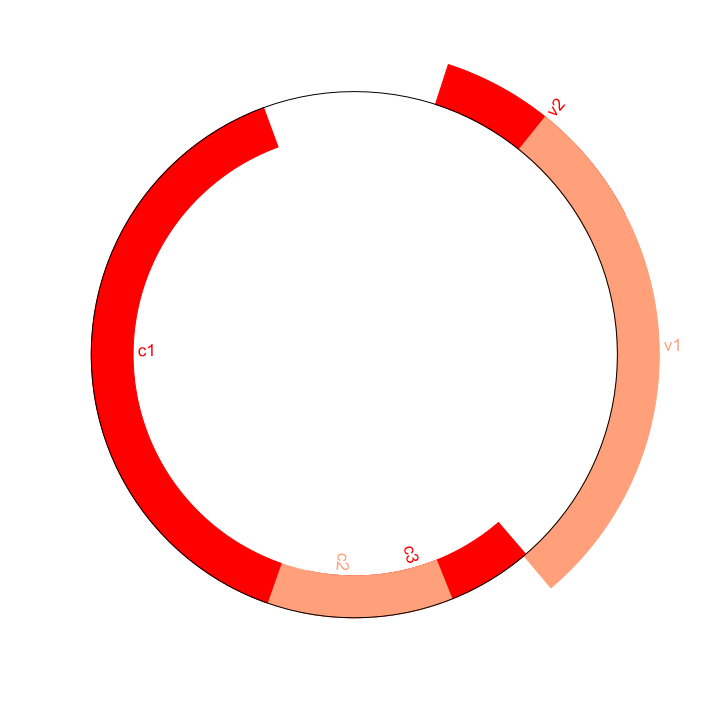

# ACM Research Coding Challenge (Spring 2021)

## Diagram

## Solution/Work Process

When first looking at this coding challenge, I was unsure of what libraries to use in order to create a mapping of a circular genome.

I then researched for a python parser that deals with genome maps, allowing me to come across the Biopython library. By studying the 
documentation within the given sources, I was able to discover how to access the genbank file and specify certain features.

Furthermore, I was able to construct the circular genome map by using a read function in order to parse the genbank file. This allowed
for the given data to be put through the feature set, which drew the map within a PNG file that includes specified features (i.e. colors,
label size, positioning).

## References

https://biopython-tutorial.readthedocs.io/en/latest/notebooks/17%20-%20Graphics%20including%20GenomeDiagram.html#A-top-down-example

https://biopython.org/wiki/SeqIO
